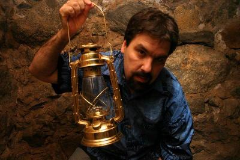

On November 8th and 9th, JASON SCOTT, independent filmmaker, computer archivist, activist, and historian, and purveyor of tuna for @Sockington, the most popular cat on the internet, will be visiting the University of Maryland campus. Jason will screen his latest documentary film, GET LAMP, about text adventures aka interactive fiction, on the evening of Monday November 8th, at 7:00pm in Ulrich Recital Hall (in Tawes Hall). He will introduce the film and take questions afterward. The screening is free and open to the public. On Tuesday, November 9th, at 12:30, Jason Scott will deliver a talk entitled "Where the Magnet Hits the Metal: Computer History on the Ground" as part of the Digital Dialogues series at the Maryland Institute for Technology in the Humanities (MITH). MITH is located on the basement level of McKeldin Library. The talk is also free and open to the public.

Jason's visit is co-sponsored by MITH, the Digital Cultures and Creativity program in the Honors College, and the Computer Science Department. For more information, please contact Matthew Kirschenbaum, 301-405-8505 or mgk at umd dot edu.

More about Jason: JASON SCOTT is a computer historian and documentary filmmaker who has been collecting, archiving and presenting computer history for over 20 years. Most of his collections can be seen online at the site TEXTFILES.COM, which began as a small archive of 1980s computer bulletin board history and has expanded to over fifty years of documents and artifacts. Besides presenting at computer conferences and other events, Jason has also shot two documentaries, BBS THE DOCUMENTARY and GET LAMP, the second of which covers the text adventure game genre, a precursor to the modern games industry. An outspoken critic of poor data archiving and destruction of digital history, Jason co-founded Archive Team, an activist group of rogue archivists dedicated to saving digital history and gaining attention to the importance of the artifacts online communities. Improbably, he also works for the most popular cat on Twitter, @sockington, who has nearly a million and a half followers.

More about GET LAMP: At the dawn of the era of home computing, an unusual type of game was the most popular to play. With just a screen of text and a prompt, you would be asked the simple question: What do you want to do next? As you typed in commands and sentences, the games would tell you a story a story fraught with danger, excitement, puzzles and hours of exploration. They were called text adventures, adventure games, and interactive fiction. They dominated the sales charts and introduced millions to the power and flexibility of home computers. No other type of computer game could come close. And then they were gone forever. Or maybe they never actuallyleft. Director Jason Scott interviewed dozens of creators, players, and scholars about the experience and effect of text adventures and interactive fiction. The result is Get Lamp, a documentary with multiple paths that takes you from a cave deep in Kentucky to the arrival of what some think is a brand new form of literature. What do you want to do next? (Trailer for GET LAMP:[ http://www.getlamp.com/](http://www.getlamp.com/)).
