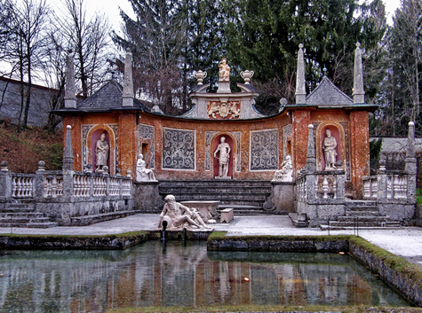

As a young student at Oxford, [Franklin J. Hildy](http://mith.umd.edu/theatrefinder/index/fhildy), found himself returning to school after a six-week tour of Europe only to realize that he had often been within proximity of a historic theatre, but had inadvertently bypassed it without knowing it was there. In an effort to provide a comprehensive study to historic theatres where there was none, Hildy, now Professor and Director of Graduate Studies in the [Department of Theatre at the University of Maryland](http://tdps.umd.edu/), started collecting information in the early 80s. Yet as his research grew from Greek and Roman theaters, to include Eastern European, North African, and Middle Eastern sites, he found himself restrained by the print medium. Contemporary reference books proved inadequate: the entries were not sufficiently comprehensive, and by the time the book was printed, the material was outdated.

With support from a two-year resident fellowship awarded by the Maryland Institute for Technology in the Humanities (MITH), Hildy is now providing the comprehensive theatre architecture resource that previously was lacking.  This week marks the launch of [Theatre Finder](http://mith.umd.edu/theatrefinder/): a collaboratively edited, peer reviewed, online guide to historic theatre architecture over 100 years old, which uniquely incorporates sites from multiple geographic regions over several time periods. Each item page displays a photograph of the theatre (over 100 sites have been photographed by Hildy himself), next to a basic description, related neighboring sites, location, time period, architectural type (Baroque, Hellenistic, Roman etc.), listed aliases, and corresponding Global Positioning System (GPS) coordinates. Users who wish to add a theatre to the database, are asked to follow the [contributor guidelines](http://mith.umd.edu/theatrefinder/index/contribute). Submitted contributions are vetted through an editorial board that reviews the submissions.

Given that no universally-accepted, authoritative text exists for theatre architecture, Hildy believes that the peer reviewed nature of Theatre Finder provides a much-needed, rich, and expansive resource. Theatre Finder “opens up new avenues of research, even for those who are familiar with theaters, and have spent years browsing through the existing theatre guides,” Hildy says. Furthermore, Theatre Finder brings attention to historic preservation, by frequently reporting on theatres that are deteriorating or have already disappeared. The problem of maintenance and preservation is often dependent on insufficient funds within local governments. Hildy hopes that by putting this material in an openly-accessible environment, users will visit the theatres in person, and bring attention to the need to maintain these historic sites. Theatre Finder includes theatres located in distant locales that were previously unknown or hard to access. Hildy has identified close to 2,000 theatres in China. In order to document this data with accuracy, he is working closely with a professor in China interested in theater preservation to build that portion of the website. Conversely, the project also documents those theatres that were perhaps always under the noses of its inhabitants, tucked away in private castles. “In Italy, there are new theaters from the 17th-18th centuries that are turning up constantly,” Hildy says. “Someone had a theatre in their castle but it had not been open to the public until now.” Likewise, in France, a lift on a previous law that taxed the owner if there was a theatre in the building, has caused more theatres to be reported.

Working with the [Theatre Historical Society of America](http://www.historictheatres.org/) and the [Association of Historic Theatres in Europe](http://www.perspectiv-online.org/), Hildy is currently building a consortium of institutions to obtain funding for further project development, expand the project data set, and translate the website into various other languages to increase use and accessibility. In its next phase, Theatre Finder will link the GPS coordinates associated with each theatre to Google Earth. Hildy is looking into developing an app that enables both the casual viewer and the scholar to punch the site coordinates into their phone and be directed to the theatre’s geographic position, thus encouraging on-site visits, as well as motivating local governments to preserve these historic gems. While traveling to several hundred theatres in twenty five countries over the past thirty years, Hildy has had to jump fences in Greece and Turkey and navigate around sheep in Spain. His passion for performance history comes alive in the presence of the space. Hildy remarks, “The sense of the space and how it structures the relationship the audience can have with the performers is quite palpable...you start to develop
