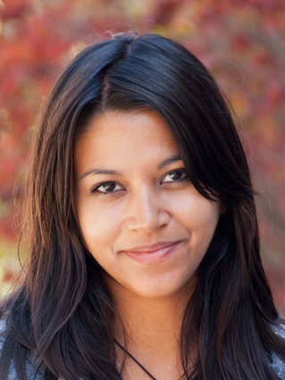

Tuesday, September 20, 12:30-1:45PM MITH Seminar Room, McKeldin Library B0131

"Large Scale Text Analysis in the Digital Humanities: Methods and Challenges" by ADITI MURALIDHARAN

To tackle increasingly large digitized archives of text, the digital humanities community has responded with an avid interest in text mining and visualization. Everywhere one looks these days, computer scientists are bringing text analysis to humanities scholars with tutorials, workshops, and toolkits. Nevertheless, crucial information is being lost in translation. If text analysis toolkits are to be truly successful, information needs to start flowing the other way and computer scientists must learn from humanities scholars what humanistic text analysis really means. If not, they will continue making "natural" assumptions that do not always translate into the humanities such as, for example, that concepts like "question", "hypothesis", "data", "evidence" are always well-defined in scholars' minds, and universal to all analysis. In in the extreme case, this misalignment of basic assumptions could lead to fleets of powerful text analysis tools that nobody knows how to actually apply to humanistic analysis.

In this talk, Aditi Muralidharan, Computer Science Ph.D. Candidate at UC Berkeley, will describe her experiences collaborating with English scholars to build the NEH-funded WordSeer text analysis toolkit, and discuss differences between the ways that computer scientists and humanities scholars view text analysis, and ways in which communication between the two fields can be improved. This talk will be held in the MITH Seminar Room, in the basement of McKeldin Library.

[Aditi Muralidharan](http://web.archive.org/web/20131208190527/http://www.eecs.berkeley.edu/~aditi/) is a Ph.D. candidate within the Department of Computer Science at the University of California, Berkeley. She builds and researches systems for large-scale text analysis. This April, her work on the WordSeer project won the support of a 2011 NEH Startup Grant.

A continuously updated schedule of talks is also available on the [Digital Dialogues](http://mith.umd.edu/podcast/) webpage.

Unable to attend the events in person? Archived podcasts can be found on the MITH website, and you can follow our Digital Dialogues Twitter account [@digdialog](http://twitter.com/#!/digdialog) as well as the Twitter hashtag #mithdd to keep up with live tweets from our sessions.

All talks free and open to the public! Refreshments are often provided but attendees are welcome to bring their own lunches.

Contact: Neil Fraistat, Director, MITH (http://mith.umd.edu, mith@umd.edu, 5-8927).
