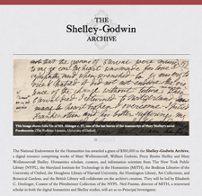

I am pleased to report that the first phase of _[The Shelley-Godwin Archive](http://shelleygodwinarchive.org/)_ is now underway. Wenfei (our intrepid intern) and I have begun to create electronic files for our diplomatic transcriptions of Mary Shelley’s _Frankenstein_ and Percy Shelley’s “Esdaile Notebook,” a collection of 58 early poems that remained unpublished until 1964. We are also preparing to encode Shelley’s hand-written revisions to his printed edition of _Queen Mab_, a portion of which was ultimately published as _The Daemon of the World, A Fragment_ in the _Alastor_ volume.

Our encoding schema is based on the [TEI P5 XML guidelines](http://www.tei-c.org/Guidelines/P5/), which gives us the flexibility to design an innovative framework that will enable end users to collate transcriptions of draft manuscripts with printed editions, to overlay and compare images of various draft states, to search all texts and transcriptions, and to tag text selections with user annotations. In conjunction with the MITH software development team, we strive to create a digital resource that takes into account not only the needs of textual scholars, but also the needs of students and teachers who are interested in learning more about the compositional process and how manuscript sources are brought to and through the press.

A significant feature of the Archive will be the detail in which we encode physical characteristics of the manuscripts, such as the use of ink or pencil; different hands within the same manuscript item; noting where pages have been damaged, torn out, or inserted; distinguishing among a variety of addition and deletion markings; and cataloging watermarks and other features of a particular manuscript source, to name just a few. These kinds of descriptive details and metadata will enable a broad array of searchable attributes relating to the compositional process that has been difficult, if not impossible, to realize using traditional methods.

As we continue to think through the kinds of features we want to incorporate into the Archive, we would welcome your thoughts about what you would find most useful when working with manuscript sources in a digital environment. So please feel free to add a comment to this blog entry or send us an email at info&lt;at>shelleygodwinarchive&lt;dot>org. Follow us on Twitter @shelleygodwin. We look forward to your comments and suggestions.
