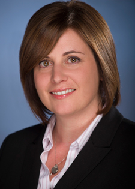

Tuesday, October 25, 12:30-1:45PM MITH Conference Room, McKeldin Library B0135

"Networked Macrosolutions: Library Peer-Sourced Collaborative Services" by RACHEL FRICK

Macrosolutions are shared global services that provide institutions with resources and solutions that have the opportunity to take advantage of networked enterprise-class scale. These types of services, which were once only locally provided, can now be distributed among institutions for a peer-sourced type of community support. By investing in a shared networked solution, academic libraries can achieve efficiencies and market influence, that would be impossible at the scale of any one institution. In order to realize the promise of networked macrosolutions, libraries must be able to externalize their service need and trust their peer counterparts to help provide services that were once traditionally a single source operation.

A key factor for success is in directly engaging with faculty and academic officers to communicate a compelling strategy in which selective externalization of services can be win-win situation for the local institution as well as for the external partners. Traditional library functions improve the libraries' ability to fulfill a local contextual academic and research mission. However, creating new avenues for networked global scale shared services can be in the best interest of all parties. For some shared services, managing them at the largest scale offers savings both in terms of that particular service as well as in terms of capital re-investment in other more locally contextually dependent services. Externalizing functions is not new – but doing so in a highly networked environment, at global-scale is. The [HathiTrust Digital Library](http://www.hathitrust.org/) and the [Digital Public Library of America](http://dp.la/) will be discussed as examples of macrosolutions and how they have the potential to change how libraries engage with scholars.

This talk will be held in the MITH Conference Room, in the basement of McKeldin Library.

Rachel Frick is the Director of the Digital Library Federation Program at the [Council on Library and Information Resources](http://www.clir.org/) (CLIR/DLF). Previous to her work at CLIR, Rachel served the National Leadership Grants Program for Libraries as senior program officer at the [Institute for Museum and Library Services](http://www.imls.gov/) (IMLS). Ms. Frick's library experiences range from being the head of bibliographic access and digital services at the University of Richmond to a regional sales manager for the Faxon Company, with a variety of library positions in between. She holds an MSLS degree from the University of North Carolina at Chapel Hill and a BA in English literature from Guilford College.

Coming up @MITH 11/01: Trevor Muñoz (Maryland Institute for Technology in the Humanities), "Learning on the Job: Data Curation by Humanists, Librarians, and the Public"

_A continuously updated schedule of talks is also available on the [Digital Dialogues](../podcast/) webpage._

_Unable to attend the events in person? Archived podcasts can be found on the MITH website, and you can follow our Digital Dialogues Twitter account [@digdialog](http://twitter.com/#%21/digdialog) as well as the Twitter hashtag #mithdd to keep up with live tweets from our sessions._

_All talks free and open to the public. Attendees are welcome to bring their own lunches._
