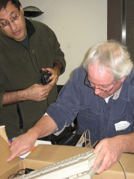
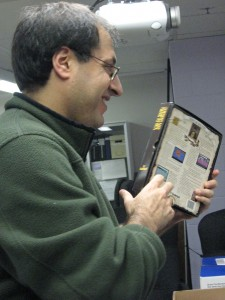

\[fusion*text]COLLEGE PARK -- The Maryland Institute for Technology in the Humanities (MITH) has received a major collection of electronic literature and vintage computer hardware from pioneering hypertext author Bill Bly. Bly's generous donation includes a rich archive of materials from the early literary hypertext movement, and joins the existing [Deena Larsen Collection](http://mith.umd.edu/larsen/) also housed at MITH. Together, these two collections position MITH as a major center of study for anyone interested in primary source materials--both manuscript and born-digital--from this unique moment in literary and technological history.\[fusion_text]"The materials are from the incunabulum period of electronic literature," says Bly. "Not only are the texts significant—some of which will disappear—but it is difficult to get at what the author intended without the original hardware." Bly's collection includes numerous exemplars of hypertext fiction and poetry collected over the years, as well as his own notes and variations for \_We Descend*, his ongoing hyper-fiction, the first volume of which was published by [Eastgate Systems](http://www.eastgate.com/) in 1997. The collection is particularly rich in materials related to the early Macintosh software HyperCard, used as the platform for dozens of works of early electronic literature.

Notably, the protagonist of _We Descend_ is an archivist. Bly notes that now, "the archive \[is] needing to be archived--anticipating it's own demise and rescue. The archivist is retrieving past lives, constantly having to deal with the degeneration of media. Everyone is dealing with the transmission of the story. The archivist exists on a personal level as opposed to the institutional level, that is, the institutions that sponsor archives but also impose order on them." \[fusion*text]The hypertext experiment originated in the 1980s as a small, closely-knit group of literature enthusiasts, authors, critics, and software developers. Michael Joyce is credited with authoring the first literary hypertext, \_Afternoon, a story*, published by Eastgate in 1990 (though written several years earlier). Bly became hooked on hypertexts after taking "Hypertext Poetry & Fiction" through The New School in New York City. "In one's mind, text exists differently than the linear structure on the page," says Bly. "Hypertext is the closest thing we have to a mental structure."

Speaking fondly, Bly describes the social history of the early hypertext movement, and its tightly knit community. The original culture has changed since hypertexts started migrating to the Web during the early 1990s. Associate Director of MITH Matthew Kirschenbaum remarks, "Hypertext was originally about new forms of narrative story-telling; what is happening on the Web these days often tends to be more visual and cinematic." Several of the original Eastgate hypertexts are now being reworked for release on the Apple iPad. \[fusion*text]Bly is currently completing *[We Descend, Volume Two](http://www.wedescend.com/).\_ He will be presenting a live demo of the work November 19-20 at [Dangerous Readings](http://www.eastgate.com/DangerousReadings/) in Watertown, MA.

"As with the Deena Larsen Collection," Kirschenbaum says, "we at MITH see Bill's gift as a _living archive_, to be accessed, explored, and enjoyed as openly as possible by students and researchers. We will be working to catalog and describe the materials, and we welcome anyone with an interest in exploring the history of hypertext to contact us about a visit."
