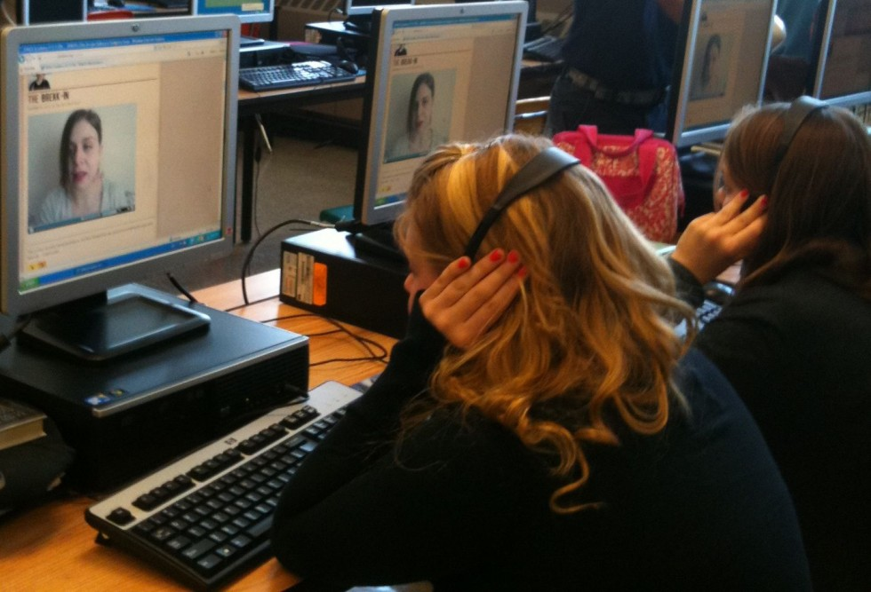

Tuesday, November 29, 12:30-1:45PM MITH Conference Room, McKeldin Library B0135

"'It's not a game to me:' ARGs, Game Design & Secret Agents in the Schoolroom" by BETH BONSIGNORE, ANN FRAISTAT, KARI KRAUS, AMANDA VISCONTI [The Arcane Gallery of Gadgetry (AGOG)](http://www.arcanegalleryofgadgetry.org/) is a sort of narrative [wunderkammer](http://jeresmith.com/portfolio/objects/object-wunderkammer.jpg) of an alternate reality game (ARG), a "cabinet of curiosities" combining a rich and oftentimes mysteriously fragmented historical tapestry with what Rob MacDougall has called "playful historical thinking." By incorporating [counterfactuals](http://www.colitz.com/site/0906/0906_view.html) and re-imagining the past, AGOG is designed to lead players into a newly enfranchised relationship with history, teach them [STEM](http://www.colitz.com/site/0901/0901_view.html) and information literacy skills, and help them discover the secret stories outside most history books. In the first full-fledged season of the game, middle school players raced against time to gain cryptographic, [archival](http://colitz.com/site/556248/556248.htm), cartographic, and inventor skills that would help them prevent a dangerous rift in the course of history. In today's talk, attendees will also take part in an activity. With each season of the ARG based around a different intriguing lost invention from the Arcane Gallery of Gadgetry, there's always a new story to uncover, a new rabbit hole to fall down–and it's never too late to change the past!

This talk will be held in the MITH Conference Room, in the basement of McKeldin Library.

The AGOG ARG was part of "ARGs in the Service of Design and Education," an NSF-funded study of the design process and [educational](http://www.colitz.com/site/1003/1003.html) use of ARGs. The purpose of the ongoing research around the ARG is to better understand how transmedia storytelling experiences can be used as novel educational activities and how experts and novices create transmedia experiences and experience them. The AGOG team includes Kari Kraus (iSchool/English Dept.), Beth Bonsignore (iSchool), and Amanda Visconti (English Dept.) at UMD, Derek Hansen at BYU, and Ann Fraistat. Read more about the game and the research behind it at [ArcaneGalleryOfGadgetry.org](http://www.arcanegalleryofgadgetry.org/).

Coming up @MITH 12/06: Nancy Proctor (Head of Mobile Strategy and Initiatives at the Smithsonian Institution), "Mobile for Museums and Cultural Heritage"

A continuously updated schedule of talks is also available on the Digital Dialogues webpage.

Unable to attend the events in person? Archived podcasts can be found on the MITH website, and you can follow our Digital Dialogues Twitter account [@digdialog](//twitter.com/digdialog) as well as the Twitter hashtag #mithdd to keep up with live tweets from our sessions.

All talks free and open to the public. Attendees are welcome to bring their own lunches.
