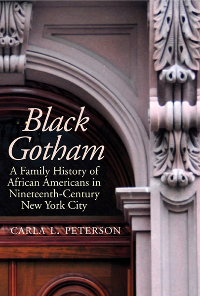

As a professor in the humanities, I've spent a career committed to scholarly research. But I confess to having definite likes and dislikes.

Here's what I like: going to the archives and rooting around looking at old documents, admiring early print fonts and deciphering barely legible handwriting; finding little scraps of paper with gold mines of information on them; creating stories out of these scraps and publishing them in essay or book form; talking about them to anybody and everybody willing to listen.

Here's what I don't like: sitting in front of my computer trying to engage with new media. I admit to being technologically challenged. I can word process (do people still use that term?) and email, and I love wasting time googling this, that, and the other. But that's about it. I don't do facebook (I think you're supposed to do something with a wall), I don't twitter or tweet (in fact I'm not sure what the distinction between the two is). I do own a cell phone but the only function that works is making outgoing calls; it's definitely not for tm (is that short for text messaging?).

So you might well wonder why I went online a few nights ago and, with massive spousal support and encouragement, purchased a domain name: [www.blackgothamarchive.org](http://www.blackgothamarchive.org/).

Earlier this spring Yale University Press published my book*,* [Black Gotham:](http://yalepress.yale.edu/book.asp?isbn=9780300162554)_[ A Family History of African Americans in Nineteenth-Century New York City](http://yalepress.yale.edu/book.asp?isbn=9780300162554)_. It was eleven years in the making, and I suspect it took that long because of my addiction to archival research and playing with narrative form.

An early paragraph in the book explains my general goal:

_"We still hold certain truths about African Americans to be self-evident: that "New York State before the Civil War" denotes a place of freedom; that "blacks in New York City" designates Harlem; that the "black community" posits a classless and culturally unified society; that a "black elite" did not exist until well into the twentieth century. The lives of my forbears belie such assumptions. They were born free at a time when slavery was still legal in New York State. They lived in racially mixed neighborhoods, first in Lower Manhattan and then after the Civil War in Brooklyn, at a time when Harlem was a mere village. They were part of New York's small but significant black community, and specifically its elite class."_

To make my argument, I structured my book around two concepts. The first is generational history, in which I focus on the lives of my great-great-grandfather—Peter Guignon—his son-in-law and my great-grandfather—Philip Augustus White—their families, and friends as entry points into a broader social and cultural history of New York City's black elite from about 1805 to 1895. The second is social geography in which I illustrate how members of this elite inhabited a series of concentric circles, each broader than the last, that gave meaning and shape to their lives: 1) their elite social circle; 2) the larger black community; 3) city neighborhoods and the city itself; 4) locations beyond the city (ties with blacks in Boston, Philadelphia, etc.); 5) and the world itself (since they originated from all parts of the globe). I argue that in contrast to the all too familiar Harlem model, nineteenth-century black New Yorkers lived throughout the entire city, in different wards and neighborhoods, and came into contact with a wide range of the city's white inhabitants through a variety of contacts, some predictable, some not.

This past spring I gave many talks to both general and academic audiences about Black Gotham and, after a summer hiatus, have started my book tour again which will continue until March 2012. My audiences have been especially fascinated by two aspects of my work: my exposition of New York's black history before Harlem, and my use of family to tell a larger history. Many people tell me that they have stories of their own they want told, but they're daunted by the task of doing years of research, writing a manuscript, finding a publisher, and then attracting readers. I've reluctantly come to see the limitations of the printed essay and book. So one of my goals with the "Black Gotham Digital Archive" is to provide a platform on which those with New York family histories can add their own stories. Out of readers I hope to create writers. I'm hoping that the result will be an even more detailed portrait of black New Yorkers in the nineteenth century than my book provides.

\_\_\_\_\_\_\_\_\_\_\_\_\_\_\_\_

_Editor's Note_: Carla L. Peterson is professor of English at the University of Maryland. She is the author of _"Doers of the Word": African-American Women Speakers and Writers in the North, 1830–1880._ She currently is completing a faculty fellowship at MITH. This post originally appeared at \_[Black Gotham Archive](http://www.blackgothamarchive.org/) \_on October 31, 2011.