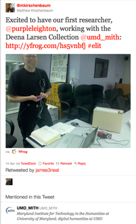

“Collecting and hoarding, it turns out, are very important activities, since too few of our cultural institutions and repositories are yet engaged with acquiring and saving the rich and various creative legacy we have inherited from the first generation of personal computing.” ([About the DLC](http://mith.umd.edu/larsen/about/about))

In mid-April I had the distinct pleasure of visiting the hoarder’s paradise that is [_The Deena Larsen Collection_](http://mith.umd.edu/larsen), housed—physically and electronically—at the [Maryland Institute for Technology in the Humanities](http://mith.umd.edu) (MITH).

I drove to College Park from the University of Illinois at Urbana-Champaign to visit the _DLC_ for a couple of reasons. The immediate matter was to review the _DLC_ in fulfillment of an assignment for the Digital Humanities course, taught by [GSLIS](http://www.lis.illinois.edu/) Dean [John Unsworth](http://www.lis.illinois.edu/people/faculty/unsworth). Further, I was curious to see if the DLC housed changing versions, programming notes, original image files, etc. for Deena Larsen’s important—and unreleased—hypertext work, _Marble Springs, Second Edition_ which is the focus for my Master’s Thesis, guided by Prof [Jerry McDonough](http://www.lis.illinois.edu/people/faculty/jmcdonou). (I was not disappointed!)

<!-- @font-face {   font-family: "Cambria"; }p.MsoNormal, li.MsoNormal, div.MsoNormal { margin: 0in 0in 0.0001pt; font-size: 12pt; font-family: Cambria; }div.Section1 { page: Section1; } -->

(A brief aside: The _DLC_ website on [_Marble Springs_](http://mith.umd.edu/larsen/about/marblesprings) focuses on _Marble Springs, First Edition_, produced in Apple’s _HyperCard_ software and published by Eastgate Systems in 1993. _Marble Springs, Second Edition_—expanded with new content added by Deena and contributed by a dozen additional authors—was prepared for publication in 1997 by Deena and programmer Carlos Boutran.

Sadly, _MS2_ was not released, although _MS1_ is [still available](http://www.eastgate.com/catalog/MarbleSprings.html) from Eastgate.)

I spent two days at MITH, exploring the _DLC_, talking with the [MITH staff](http://mith.umd.edu/people) (a shout of thanks to Director Neil Fraistat, Dave Lester, Seth Denbo, Christina Grogan, James Neal, and Alex Quinn) and interviewing Associate Director Matthew Kirschenbaum. Everyone made me welcome. And as I was the first external researcher to utilize _The Deena Larsen Collection_, I felt like a bit of a celebrity: Matt even Tweeted about my visit.

At right, I am exploring the box with the paper version of _Marble Springs_; Deena’s 1992 Master’s Thesis, _Hyperpoems and Hyperpossibilites_, and other analog treasures.

While talking about the _DLC_ with Neil, he was nice enough to invite me to post to the [MITH blog](http://mith.umd.edu/blog/) about my experience at MITH. I happily accepted. So this will be the first of a short series of postings highlighting _The Deena Larsen Collection_. The posts will include what is special about the _DLC_, issues facing the collection, and notes on my interactions with the collection, including suggestions to aid future researchers.

I hope that you will find these posts useful and will make time to visit _The Deena Larsen Collection_ at MITH soon.

**Up next: **_The Deena Larsen Collection_ as a Research Test Bed

\_\_\_\_\_\_\_\_\_\_\_\_\_\_\_\_\_\_\_\_\_\_\_\_\_\_\_\_\_\_\_\_\_\_\_\_\_\_\_\_\_\_\_\_\_\_\_\_\_\_\_\_\_\_\_\_\_\_\_\_\_\_\_\_\_\_\_\_\_\_\_\_\_\_\_\_\_\_

Want to schedule a visit to the _DLC_? Use the form at <http://mith.umd.edu/larsen/contact>

Image credits:

The_Deena_Larsen_Collection.png, Leighton Christiansen, April 14, 2011

_Marble Springs, Second Edition_, cover card, MS2_001_01.png, screen capture, Leighton Christiansen, January 10, 2011

DLC_Tweet.png by Matthew Kirschenbaum, 04/14/2011, screen capture Leighton Christiansen

Leighton Christiansen is pursing his Master’s of Library and Information Science Degree at the Graduate School of Library and Information Science (GSLIS), at the University of Illinois at Urbana-Champaign, and threatens to catch that degree any time now.

You can reach him at leightonlc@gmail.com, or [@purpleleighton](https://twitter.com/purpleleighton) on Twitter