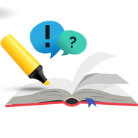
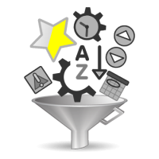
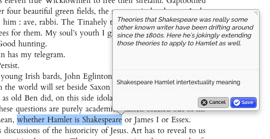
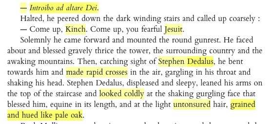
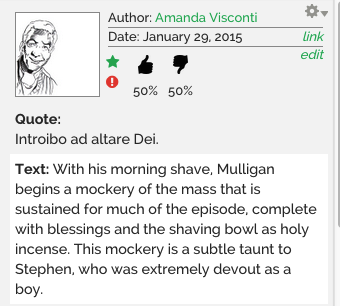
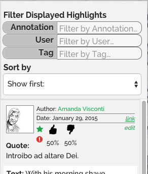

Since my [last post](http://mith.umd.edu/invitation-beta-test-infinite-ulysses-digital-edition/ "An Invitation to Beta-Test the Infinite Ulysses Digital Edition") in January, I've used feedback from generous beta-testers to bring [the Infinite Ulysses participatory digital edition](http://www.infiniteulysses.com) up to where I'd hoped it would be by the end of my dissertation. In the past, I invited users in small batches from a list of readers who signed up to beta-test. I wanted to continue testing early and often, slowly ramping up the formality of my testing from the informal conversations I used during the previous year to formal survey metrics.

## Private beta ends, public beta opens

As of last week, I've soft-launched an open beta of the site, and **I'm now publicly inviting everyone to [come give the site a try](http://www.infiniteulysses.com)**. Interested readers can now create a site account for themselves and immediately begin using all the site's features without needing to wait for an email invitation.

Now that I'm wrapping up the site work that's in scope for completing the dissertation, I've shifted from full-time design and development to writing a whitepaper report on the project.

This piece will pull together all the pieces that exist beyond the InfiniteUlysses.com site—things like a literature review for precedents to my project, user study results and analysis, and a return to my original research questions with what the project has helped me learn.

_The front page of InfiniteUlysses.com uses these visuals to show the site's highlighting, annotation, and customization features (see credits for remixed vector images [here](https://github.com/amandavisconti/infinite-ulysses-public#appearance))._

## Current site features

These screenshots offer a quick overview what you can do on Infinite Ulysses: 

**Screenshot 1: **Highlight words and phrases and type in an annotation related to that highlight (comment, interpretation, question). You can add tags to the annotation to help readers filter in annotations that help or interest them, and filter out annotations that aren't useful for them.

**Screenshot 2: **You can read annotations left by other readers by clicking on any of the highlights. Deeper yellow highlights mean a word or phrase has more than one annotation on it.

**Screenshot 3: **The sidebar initially shows random annotations for the whole page. Clicking on a highlight makes just the annotations tied to that highlight appear in the sidebar.

**Screenshot 4: **In addition to adding tags to annotations, you can up- or down-vote them, favorite them (you can see a list of your favorites on your account page), or report them for moderation. What highlights are displayed on a page can be changed using the filters for annotation text, author, and tag. When a highlight has more than one annotation tied to it, you can prioritize which annotations appear on top in the sidebar by creation date or the annotations' rankings.

_Amanda Visconti is the 2014-2015 [Winnemore Digital Dissertation Fellow](http://mith.umd.edu/people/person/amanda-visconti/) at MITH._
