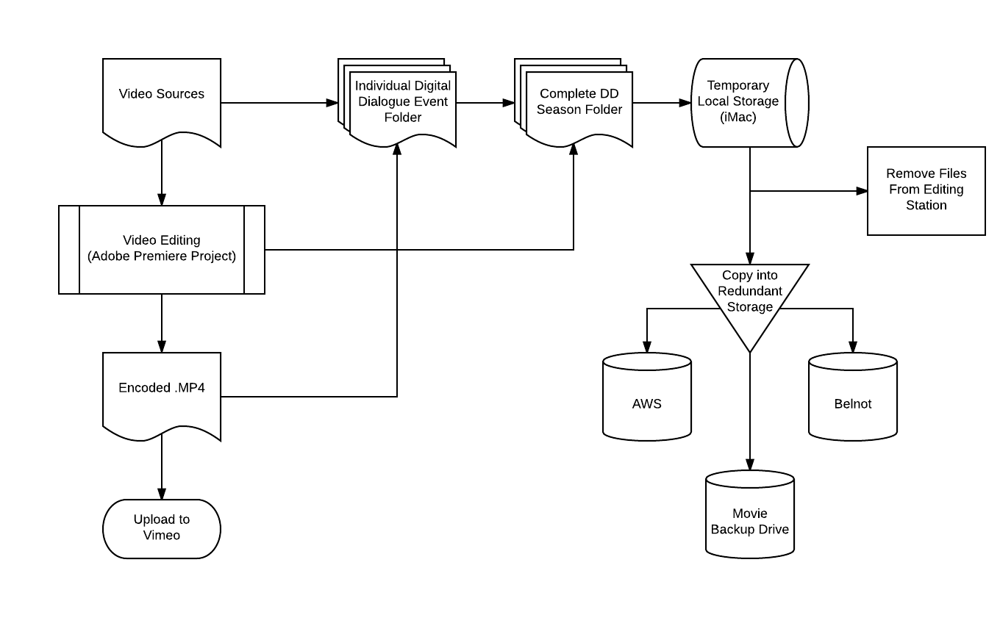
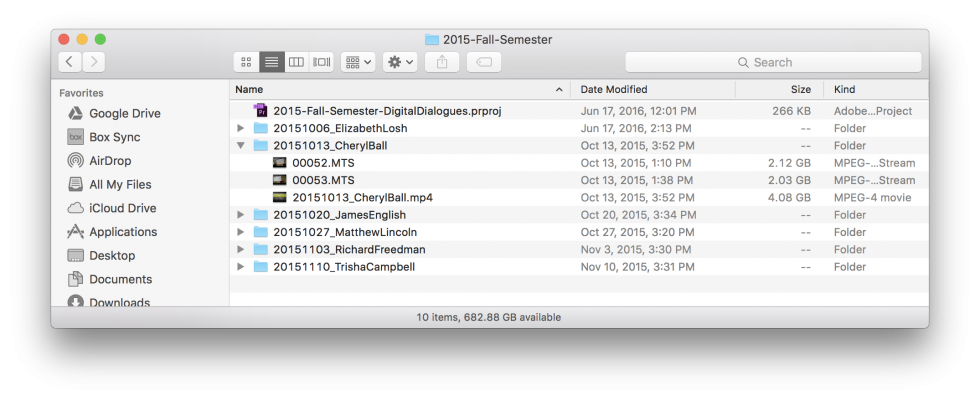

_This is the 5th post in [MITH's Digital Stewardship Series](http://mith.umd.edu/tag/mith-digital-stewardship-series/). In this post, MITH's summer intern David Durden discusses his work on MITH's audiovisual collection of historic Digital Dialogues events._

I was brought on as a summer intern at MITH to work on a digital curation project involving [Digital Dialogues](http://mith.umd.edu/digital-dialogues/), MITH’s signature events program featuring speakers from around the U.S., and occasionally beyond, which has been running for eleven years. The Digital Dialogues events program has documented the development of the digital humanities as well as the ideas and work of several of the pioneers of the field. However, as the digital humanities grew and developed, so did the technology used to record and edit the Digital Dialogues. This digital record must be curated and preserved in order to ensure that the Digital Dialogues events are accessible for many years to come.

Staying current with changes in digital audio and video recording and editing resulted in a variety of media sources, file types, storage locations, and web-hosting services. MITH currently has a workflow for recent and future Digital Dialogues that ensures proper storage of raw video, systematized file naming-conventions, standards for video editing and the creation of web content, and redundant storage. This plan, in some form, must be retroactively applied to almost a decade of content.

Since I was dealing with a variety of locations for content, the first task at hand was to consolidate media from all storage locations and resolve discrepancies and duplications. This resulted in aggregating all available content from an editing workstation, an external drive, an AWS server, and a local server. Once all the content was funneled into a singular location, I began the slow and tedious process of comparing files and folders. I was able to separate usable media from everything else and began moving content into a well-organized master directory that will be cloned into redundant storage for preservation. Future workflows will prevent discrepancies by having content be imported, named, organized, and edited on the local workstation and then copied to external storage sources to prevent duplication or accidental changes to archived content.

MITH had been successfully saving multiple copies of files across different storage devices, but many of these files reflected out-dated workflows and there were often several versions of the same file. The recording of Digital Dialogues went through several technological evolutions and left behind a messy file structure. Some source files were saved, others are missing. Some final product videos and recordings were duplicated across local storage devices, others exist solely in the Internet Archive and other web-hosting services. MITH’s early Digital Dialogues provide an example of the danger inherent in relying on singular storage locations and web-hosting services to archive digital assets. The file compression used by many services, as well as the possibility of service interruption, make web-hosting a ‘front-end access-only’ form of digital storage. The important thing to emphasize here is that once digital source media is lost, it is usually lost forever, which is why it is always necessary and recommended to have a data management plan ready at the onset of any digital project.

Data storage isn’t the only challenge that the Digital Dialogues collection presents as the collection has moved through different A/V editing workflows and standards. The Digital Dialogues transitioned from audio recording to video recording, as well as from using iMovie to Adobe Premiere to edit video, a transition that has left a considerable number of useless project files lingering about. The differences between the two video editing software suites are considerable and present several challenges to long term functionality. Adobe Premiere and iMovie handle the import of source media very differently. Premiere doesn’t actually import the source media, but instead creates a link to the file using a system path, which results in project files that are only a few hundred kilobytes in size. IMovie, however, stores a copy of the original media as well as a variety of program specific data, which greatly increases the size of the project folder. Additionally, Adobe Premiere allows for backwards compatibility to some degree, whereas iMovie does not, making Premiere a better choice for long term functionality of project files.

The links that Adobe Premiere creates to source media are problematic because, if the source media changes location or filename, the links are effectively broken and media must be relocated before any editing can occur. However, as long as the source media is preserved and is identifiable, it is a simple task to point Premiere to the correct location of the source. To ensure MITH’s future access to working project files (which is important if a derivative is lost and needs to be regenerated, or video formatting needs to be updated for a website), I created a well organized and descriptively named directory containing all project files and associated linked media. The current editing and curation plan involves each Digital Dialogue event being stored in a folder containing source media and the edited derivative. Before transferring any source media, an appropriate directory is created to store the files. Files are then transferred from an external storage device or camera to the video editing iMac work-station and stored in the appropriate event folder. The event folders are named using the following convention:

> **‘YYYYMMDD_SpeakerNameInCamelCase_AdditionalSpeakersSeparatedByUnderscores’**.

Events are organized by season (e.g., Spring 2016) and stored in a season folder using the following convention:

> **‘YYYY-Season-Semester’**.

All events for a season will be edited in a single Adobe Premiere project file that is located within the season folder. This reduces the amount of project files to manage and also streamlines the video editing process.

Another part of this project consisted of editing previous content to conform to current standards. Due to the variety of files that existed, both formats and duplicates, I decided to prioritize raw footage (or the highest quality derivative that I could discover) for archiving and the creation of new videos. Provided that usable media was accessible, videos currently on the MITH website are being updated to reflect proper MITH logos and branding, as well as title slates with appropriate attributions to speakers, dates and talk titles. There are also many years of Digital Dialogues recorded as audio, which are in the process of being exported to a standardized video format so that the majority of Digital Dialogues will be accessible to the user through one hosting service (Vimeo). At the end of the project, I will have created or recreated around 105 videos, streamlined and documented any changes to MITH’s audiovisual workflows, and ensured proper digital stewardship of an important collection of digital humanities scholarship. My second and final blog post in this series will highlight some of the more interesting content in this collection.
