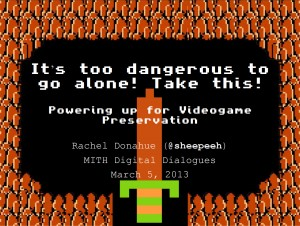
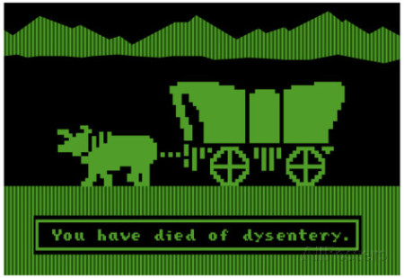
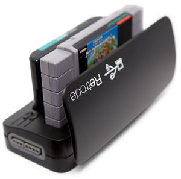

_This is the 6th post in [MITH’s Digital Stewardship Series](http://mith.umd.edu/tag/mith-digital-stewardship-series/). In this post, MITH’s summer intern David Durden discusses his work on MITH’s audiovisual collection of historic Digital Dialogues events._

The Digital Dialogues series showcases many prominent figures from the digital humanities community (e.g., Tara McPherson, Mark Sample, Trevor Owens, Julia Flanders, and MITH’s own Matthew Kirschenbaum) speaking about their research on digital culture, tools and methodologies, and the interlocking concerns of the humanities and computing.

As mentioned in my [earlier post](http://mith.umd.edu/decade-digital-dialogues-event-recordings-challenges-implementing-retroactive-digital-asset-management-plan/), the nature of this collection presents several challenges to preservation and access as the series continues on into the future. As with many collections that are the focus of digital curation, the topics and subject matter covered in the Digital Dialogues continuously evolve and change over the course of the series. The collection itself is a record of the evolution of the digital humanities, the growth of MITH, and the rapid development of digital technologies, e.g., audio podcasts, multimedia podcasts, HD web hosted video.

My project was intended to help MITH balance the challenges of proper storage of existing content with the challenges of developing sustainable workflows for the dissemination of current and future content. Prior to this project, the Digital Dialogues collection was dispersed among several locations, representing different workflows, available technologies and access platforms over time. There have been 193 Digital Dialogues since September of 2005. There are recordings of 129 of these—78 recorded on video, and 51 recorded on audio (only). Access copies for videos and audio tracks were hosted in a variety of locations, such as Vimeo, Internet Archive, or an Amazon S3 server instance. Source and project files were located on a combination of the internal drive for MITH’s iMac video editing station, an external hard drive, and a separate local server. After the completion of this project, the preservation, storage and accessibility of all Digital Dialogues content has been streamlined. Source and project files are now organized in a set file directory structure and stored redundantly on two separate local drives, and all access copies are available through a single source—Vimeo—making it easier for users to have access to the entire collection. Due to weekly upload limits imposed by Vimeo, there are currently [71 videos uploaded](https://vimeo.com/album/2545093), and 45 more videos are in the upload queue and will be available soon.

Over the course of this project, I was involved in the processes of editing and exporting videos, updating the MITH site,, and preparing digital content for long-term storage, but through that process I did manage to find some time to actively engage with the sheer volume of content that exists within the collection. Several Digital Dialogues were in line with my own research interests and hobbies, so I was able to engage with the collection as both a curator and researcher, and watched these videos in their entirety.

Here are a few (only a tiny sample) of my favorites:

[Spectacular Stunts and Digital Detachment: Connecting Effects to Affects in US Car Movies, by Caetlin Benson-Allott](http://mith.umd.edu/dialogues/dd-spring-2014-caetlin-benson-allott/)

[“It’s too Dangerous to Go Alone! Take This.” Powering Up for Videogame Preservation, by Rachel Donahue ](http://mith.umd.edu/dialogues/rachel-donahue-its-too-dangerous-to-go-alone-take-this/)

[Music, Technology, and Digital Scholarship, by Richard Freedman](http://mith.umd.edu/dialogues/dd-fall-2015-richard-freedman/)These three are of personal interest to me, but each video also represents the variety of content that the Digital Dialogues has to offer. Additionally, the Donahue and Freedman pieces represent other ways that MITH is distributing content associated with each Digital Dialogue. Rachel Donahue’s Digital Dialogue page, in addition to the video of her presentation, [features her slide deck](http://mith.umd.edu/wp-content/uploads/2013/03/Rachel-Donahue.MITHDD.pdf) available for download in PDF format. Richard Freedman’s Digital Dialogue page features [a Storify recap](https://storify.com/digdialog/richard-freedman-digital-dialogue-at-mith-november) that features links to resources referenced in his presentation that are inaccessible from the video alone.

### Featured video: “It’s too Dangerous to Go Alone! Take This.” Powering Up for Videogame Preservation

I am an avid fan and player of videogames, which is why I chose to highlight the talk in this video. Rachel Donahue worked on a Library of Congress-sponsored project, [Preserving Virtual Worlds (PVW)](http://mith.umd.edu/research/pvwii/), which focused on the complexities of preserving the digital content of videogames (the Preserving Virtual Worlds website can only be viewed through the Internet Archive, but the [project report is available here](http://www.digitalpreservation.gov/partners/pvw.html)).

Donahue’s talk explains the methodology devised by PVW to determine the ‘how’ and ‘why’ of videogame preservation, which isn’t as straightforward as I originally thought. She begins with a simple explanation of what it is exactly that PVW’s videogame preservation focused on: videogames that were originally for computer or dedicated consoles, such as the Super Nintendo Entertainment System. This talk represents a wide range of preservation activities and approaches at the highest level. Donahue proceeds to explain that the problems inherent in videogame preservation stem from the existence of different preservation priorities from different members of the gaming community, e.g.: developers, players, and archivists. These sub-groups often overlap and further complicate the process. The player and developer communities may disagree about what the most important aspects of the game are, and in reference to the game Oregon Trail, Donahue states,

> “if you talk to a lot of people about the _Oregon Trail_, and ask them ‘what do you most remember about the _Oregon Trail_, what do you think is most important to the _Oregon Trail_?’, and they’re going to say things like, dysentery, trying to shoot squirrels, making it to Independence Rock before July 4th, fjording the river, having enough axles in your pack, having enough stuff in general without weighing down your oxen so much that they can’t move; maybe if you’re a little bit more observant you might think, ‘problematic portrayal of Native Americans,’ but you’re not going to say, ‘data model.’ I don’t think anybody thinks about the data model, but if you talk to the creators of the _Oregon Trail_, they are in fact going to say, ‘the data model, the statistics, those are the most important parts of the game.”

Videogames often have a multiplayer component that is a source of nostalgia for players. When comparing the gameplay between two-player _Super Mario Bros_., which can be preserved through software emulation or preservation of original hardware, to online play in _Halo 3_, which required servers operated by Microsoft in addition to the hardware and software components, one can quickly see how the ‘what’ of videogame preservation can imply drastically different things to groups within the community. Donahue also mentions that there are often unique trends and quirks for specific games within the player community which are not always preservable (such as [‘bunny hopping’ in Quake](https://wiki.sourceruns.org/wiki/Bunnyhopping)).

A variety of questions must be answered before preservation activities can move forward. The most important question is: “what exactly are we preserving?” Aside from content, videogames are data, software, hardware, unique storage media, and peripherals such as controllers. Each element of a videogame system may require a specific skillset in order to achieve any sort of reliable preservation. In the case of hardware and circuit boards, basic knowledge of electronics and computer repair may be required; when using emulation, scripting skills will inevitably be required. Videogame preservation also demands a distinction to be made between original hardware preservation and software emulation--what is the minimum level of preservation for a videogame? The question of what to save is most certainly a philosophical one: is it the aesthetic of the original object and the experience of playing the game in its original state, or will any experience involving the loose entity of the game be acceptable?

Donahue exhibits several surveys created to gauge the focus of preservation activities. For the curator or archivist, survey questions were more technical, and a few examples are ‘can the game be played’, ‘do you have the equipment to emulate’, and ‘will you provide a complete videogame experience, or will you just preserve the artifacts?’ For players, the questions are more rooted in videogame culture, for example, ‘what is the core of the game and what does it mean’, ‘what contributes to the success of a franchise’, ‘what is the importance of multiplayer’, and ‘is this a good game or a milestone game’?

Donahue and the PVW project made great strides in articulating the specific needs of videogame preservation as well as providing the groundwork for establishing preservation standards for an often overlooked and misunderstood part of our culture. This is just one of many interesting and unique Digital Dialogues within the collection - to view more, visit the [Past Digital Dialogue Schedules page](http://mith.umd.edu/digital-dialogues/past-dialogue-schedules/), where you can browse through all previous seasons and explore.
