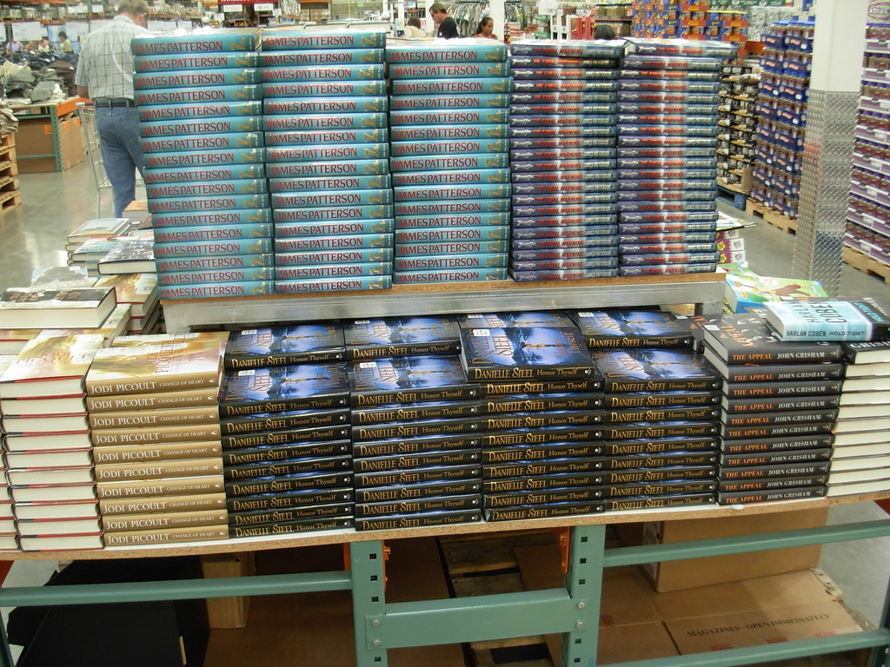

COLLEGE PARK, MD—The **Maryland Institute for Technology in the Humanities **at the University of Maryland and the **Book Industry Study Group** are pleased to announce **Books.Files**, a new project funded by **The** **Andrew W. Mellon Foundation** to assess the potential for the archival collection and scholarly study of digital assets associated with today’s trade publishing and bookmaking.

The fact is that nearly all printed books now begin—and for many practical purposes end—their lifecycles as digital files that are produced and managed by designers, editors, publishers, packagers, and printers. The printed book that we hold in our hands is just one of the outputs that can be derived from these digital assets, which are also used to produce ebooks and Web-ready texts. In particular, the role of Adobe InDesign and other software tools is not well understood outside of the industry. And yet, this is where the book stops being a manuscript and starts _becoming_ a book, by way of its transformation into a prescribed set of digital assets which in addition to the text may include stylesheets, fonts, metadata, images, and other design elements.

Led by principal investigator **Matthew Kirschenbaum**, this project represents the first organized attempt to put ambassadors from the scholarly communities traditionally invested in safeguarding and studying the material history of bookmaking into contact and conversation with thought leaders and influencers from the contemporary publishing world. The centerpiece of the project will be a **convening** to bring those figures together in New York City in early 2018; Kirschenbaum’s efforts will also be supported by **site visits** to observe the bookmaking process as it unfolds across different settings, and **interviews** with industry experts. Findings for scholars, archivists, and publishers will be presented in a **white paper** made publicly available in late 2018.

“Digital technologies have forever altered publishing workflows,” commented BISG executive director **Brian O’Leary**. “We’re looking forward to working with Professor Kirschenbaum to explore current practice and its impact on our ability to preserve content for future generations.” “This project represents an exciting extension of MITH’s long-standing interest in preserving born-digital culture,” said **Trevor Muñoz**, MITH interim director. “We’re delighted to partner in this effort.” **Karla Nielsen**, curator at Columbia University’s Rare Book and Manuscript Library, added, “For a long time publishers' archives weren't collected systematically, but now scholars are very grateful for the more complete records of earlier firms that we have, such as those of Cambridge University Press. Research libraries are just beginning to collect born-digital materials produced by publishers and this initiative will help us to understand how to do that so that there is a record of this moment of profound media change.”

The **Maryland Institute for Technology in the Humanities** is a leading digital humanities center that pursues disciplinary innovation and institutional transformation through applied research, public programming, and educational opportunities. The **Book Industry Study Group** is the leading book trade association for standardized best practices, research and information, and events. **Matthew Kirschenbaum** is Professor of English at the University of Maryland, a past Guggenheim Fellow, and author most recently _of Track Changes: A Literary History of Word Processing_ (Harvard UP, 2016).

Inquiries about **Books.Files** may be sent to [Matthew Kirschenbaum](mailto:mgk@umd.edu).
