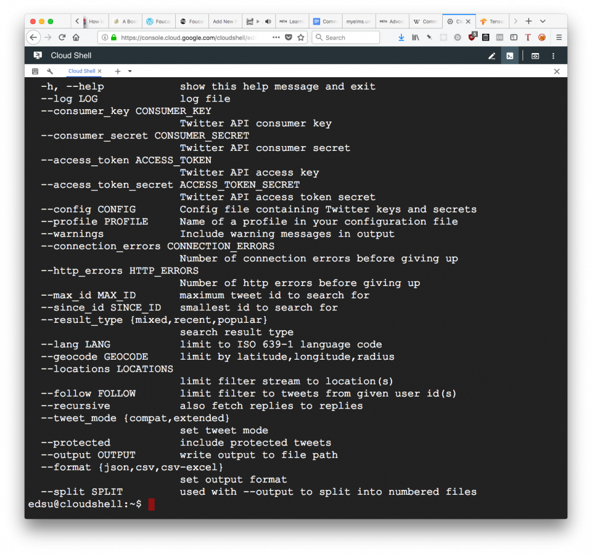

This past spring [Purdom Lindblad](https://mith.umd.edu/people/person/purdom-lindblad/) and [I](https://mith.umd.edu/people/person/ed-summers/) had the opportunity to participate in several praxis oriented sessions involving social media data collection and analysis for [Matt Kirschenbaum](https://twitter.com/mkirschenbaum)'s [Introduction to Digital Studies](https://dsah.umd.edu/requirements/#introds) (MITH 610). We thought that some of the details of how we went about doing this work could be interesting to share with a wider audience, and also wanted to begin a short series of posts that showcases the work that some students generated during the class.

[MITH 610](https://dsah.umd.edu/requirements/#introds) introduces students to current topics and critical issues in the field of Digital Studies. MITH itself functions not just as a space for the class, but also as a laboratory for experimenting with digital methods, and getting acquainted with people on campus (and in the DC area) who are doing work in the digital humanities.

For example this past Spring MITH 610 was broken up into 3 modules: Reimagining the Archive, Media Archaeology and Data Stories. In the Data Stories module we worked with students to understand how social media APIs operate, and explored how to do data collection and documentation while being guided by the principles of [Advocacy by Design](https://mith.umd.edu/advocacy-design-moving-theory-practice-part-1/). Advocacy by Design centers ethical questions of _why_ we are interested in pursuing particular sets of research questions in order to better understand _how_ we carry out the research, interpret our findings, and speculate about possible futures that they entail. These conversations compel us to ask how people are represented in, or are subjects of, academic work. Who reads and uses our work? Who collaborates and contributes to our work? Providing a welcoming and collaborative space for asking these questions is a central part of MITH's vision for digital studies at UMD, which you can also see reflected in its core [values](https://mith.umd.edu/about/values/).

One somewhat mundane, but never the less significant, challenge we often face when working as a group with different technologies is what we call _The Laptop Problem_. Fortunately, students come to class with a computer of some kind. It's almost a given, especially in a field like digital studies. On the plus side this means that students arrive to class already equipped with the tools of the trade, and we don't need to manage an actual set of machines for them to use. However on the down side everyone comes with a slightly different machine and/or operating system which can make it very difficult for us to craft a single set of comprehensive instructions for. Much time can be lost time simply getting everyone set up to begin the actual work.

We were also stymied by another problem. In introducing social media data collection we wanted to go where the Digital Humanities generally (and wisely) fears to tread: [The Command Line](https://en.wikipedia.org/wiki/Command-line_interface). In the previous Media Archaeology module, students examined and experimented with MITH's [Vintage Computing](https://mith.umd.edu/vintage-computers/) collection, which involved working directly with older hardware and software interfaces, and reflecting on the affordances that they offer. If you are curious about what this involved here's a short Twitter thread by Caitlin Christian-Lamb that describes (with some great pictures) some of her work in this module:

https://twitter.com/christianlamb/status/988913065147105280

We thought it would be compelling to introduce social media data collection by using the command line interface, as an example of a (relatively) ancient computer interface that continues to be heavily used even today, particularly in Cloud environments. But because of _The Laptop Problem_ we weren't guaranteed everyone would have the same command line available to them, or that they would even have access to it. One way of solving _The Laptop Problem_ is to provide access to a shared virtual environment of some kind where software is already installed. This is when we ran across [Google Cloud Shell](https://console.cloud.google.com/cloudshell).

Since the University of Maryland uses Google's [GSuite for Education](https://edu.google.com/) for email and other services, students are (for better or worse) guaranteed to have (at least one) Google account. As part of Google Cloud they offer any account holder the ability to go to a URL <https://console.cloud.google.com/>cloudshell which automatically launches a virtual machine in the cloud, and give you a terminal window directly in your browser for interacting with it. It is a real Debian Linux operating system, which can used without having to install any software at all.

We developed a [short exercise](https://docs.google.com/document/d/11QSMTAiGWEJM324Tpm_SNYImVxAhkeGQfg_UaV0bgsI/edit#) that walked students through how to launch Google Cloud Shell, get comfortable with a few commands, install the [twarc](https://github.com/docnow/twarc) utility, and use it to collect some Twitter data directly from Twitter's API. twarc has been developed as part of MITH's involvement in the [Documenting the Now](https://www.docnow.io/) project, and allowed students to collect Twitter data matching a query of their choosing, store it in the native JSON format that Twitter themselves make available, and download it for further analysis.

Describing all the intricate details of this data flow was well beyond the scope of the class. But it did present an opportunity for demystifying how Application Programming Interfaces (APIs) take their shape on the web, and to describe how these services make structured data available, and to who. Matt likes to refer to refer to this experience as Little Big Data. To bookend the exercise students wrote about what they chose to collect and why, and reflected on what the collected data, and the experience of collecting it said to them in the shape of a short data story. Look for a few of these stories in subsequent posts here on the MITH blog.