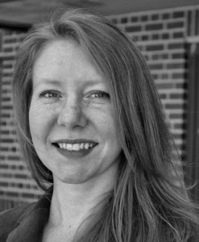

Please join us Wednesday, April 24, at 3:30pm at MITH (0301 Hornbake Library) for a presentation by [Dr. Andrea Thomer](https://sites.google.com/umich.edu/akthomer//), who is visiting from the [University of Michigan iSchool](https://www.si.umich.edu/), and does [work](https://scholar.google.com/citations?user=dagYfuQAAAAJ&hl=en) on data histories, with implications for cultural collections and humanities data across disciplines.

Natural historians create the frameworks, calendars and infrastructures that allow us to understand and grapple with "deep time" -- but they do so within their own temporally complex scholarly settings: the infrastructures and data collections that house the specimens and datasets used in their analyses. Though natural history collections are meant to last for generations, the records they contain last only years (at best) without careful maintenance and curation. Digital collections are particularly fragile, prone to bit rot and obsolescence, and must consequently be upgraded and migrated frequently. In this talk, Thomer will consider the temporal rhythms of natural history data collections, their management, and and their migration, and how that impacts the creation and management of systems of understanding – and making – “deep time.”

_Andrea Thomer is an assistant professor of information at the University of Michigan School of Information. She conducts research in the areas of data curation, museum informatics, earth science and biodiversity informatics, information organization, and computer supported cooperative work. She is especially interested in how people use and create data and metadata standards; the impact of information organization on information use; issues of data provenance, reproducibility, and integration; and long-term data curation and infrastructure sustainability -- on the scale of decades rather than years. She is studying a number of these issues through the "Migrating Research Data Collections" project - a recently awarded Laura Bush 21st Century Librarianship Early Career Research Grant from the Institute of Museum and Library Services. Dr. Thomer received her doctorate in Library and Information Science from the School of Information Sciences at the University of Illinois at Urbana‐Champaign in 2017._
