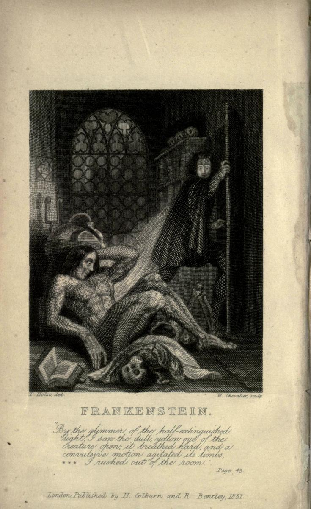

COLLEGE PARK, Md. – The University of Maryland's [Institute for Technology in the Humanities](http://mith.umd.edu/) (MITH) announces the launch of the Shelley-Godwin Archive (S-GA), a new digital resource that allows scholars, students and the public to explore in one place the widely scattered texts of England's "first family of writers."

For the first time together, the archive will make available online the manuscripts of Mary Wollstonecraft, William Godwin, Percy Bysshe Shelley and Mary Wollstonecraft Shelley. The public can take a deeper look into the creative process of literature's most iconic texts.

Building on MITH's leadership and innovation in the field of digital humanities, the technology driving the archive provides high-quality, zoomable page images, as well as transcriptions of each page created on the fly from TEI encoding. The first public release of the archive will be the fully transcribed and encoded manuscripts of Mary Shelley's _Frankenstein_ notebooks, with page images provided by the Bodleian Library at Oxford.

"We encoded each stage of the composition process, tracing the revisionary evolution of primary manuscripts from rough draft to final copy," said Neil Fraistat director of MITH and an eminent Shelley scholar. "The added value here is far greater than basic transcription that only displays text as it appears on the page without embedded contextual information."

Users will search and see for themselves insertions, deletions, shifts in hand, and other variables related to the composition process. Future archive releases will encourage "participatory digital humanities," which aims to provide web-based tools that help the archive function as a work-site for scholars, students, and the general public. Contributions will come in the form of transcriptions, corrections, annotations, and TEI encoding.

"This website is an excellent illustration of research in the humanities," said Bonnie Thornton Dill, UMD's dean of the College of Arts and Humanities. "The archive illuminates complexities in _Frankenstein_ with regard to gender and the digitization makes this information visible and accessible to a wide range of scholars and interested people."

The archive was made possible by a grant from the National Endowment for the Humanities and was created in partnership with the Bodleian Libraries of the University of Oxford and the New York Public Library's Carl H. Pforzheimer Collection of Shelley and His Circle.

To learn more about the Shelley-Godwin Archive, visit [shelleygodwinarchive.org](http://shelleygodwinarchive.org) on the evening of Thursday, October 31, 2013 when the site is scheduled to launch.

**Public Launch on October 31, 2013 in NYC**

To celebrate the launch, the New York Public Library will host a free public program on October 31 at 6 p.m. in the Margaret Berger Forum at The New York Public Library's Stephen A. Schwarzman Building at Fifth Avenue and 42nd Street. On hand will be [Neil Fraistat](http://mith.umd.edu/people/person/neil-fraistat/ "Neil Fraistat") and [David Brookshire](http://mith.umd.edu/people/person/david-brookshire/ "David Brookshire") from MITH, who will discuss the creation of the archive's first transcribed and encoded manuscript, the Bodleian Library's _Frankenstein \_Notebooks of Mary Shelley. Elizabeth Denlinger, curator of The New York Public Library's Carl H. Pforzheimer Collection of Shelley and His Circle, will give a brief overview of the archive's generation and birth. Charles Robinson of the University of Delaware will give a more extended talk on the novel's composition, illustrating how the Shelley-Godwin Archive functions in real time. Treasures from the Pforzheimer Collection will be specially shown this evening only, including the 1818 first edition of \_Frankenstein_, the first illustrated edition of 1831, playbills from early stage productions of _Frankenstein_, a 1931 edition showing photographs from the James Whale film, as well as original manuscripts from both Mary Shelley and Percy Bysshe Shelley. Please note: an rsvp is required to attend the NYPL event and can be made by emailing [elizabethdenlinger@nypl.org](mailto:elizabethdenlinger@nypl.org) or calling 212-930-0717.

**About the Maryland Institute for Technology in the Humanities**

MITH is a leading digital humanities center that pursues disciplinary innovation and institutional transformation through applied research, public programming, and educational opportunities. Jointly supported by the University of Maryland College of Arts and Humanities and the University of Maryland Libraries, MITH engages in collaborative, interdisciplinary work at the intersection of technology and humanistic inquiry. MITH specializes in text and image analytics for cultural heritage collections, data curation, digital preservation, linked data applications, and data publishing.