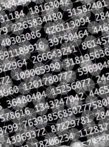

Two weeks ago a group of students, scholars and activists gathered in the evening at MITH for an event called the [Night Against Hate](http://mith.umd.edu/come-join-mith-thursday-1013-night-hate/). Our goal was to spend two hours working together to link groups and individuals documented in the Southern Poverty Law Center's [Extremist Files](https://www.splcenter.org/fighting-hate/extremist-files) to their respective Twitter accounts in order to:

- assist social media researchers who are studying the ways that these groups are operating online
- provide an opportunity for folks to respond constructively to the [rising](http://www.motherjones.com/politics/2016/10/donald-trump-hate-groups-neo-nazi-white-supremacist-racism) [tide](https://www.splcenter.org/hatewatch/2016/10/25/there-are-hate-group-leaders-twitter-too) [of hate](http://www.adl.org/press-center/press-releases/anti-semitism-usa/task-force-report-anti-semitic-harassment-journalists-twitter-2016-campaign.html?ex_cid=newsletter#.WAf7kJMrKRs?referrer=https://t.co/dTL4oXvZgD) we are witnessing in online and offline spaces

We also had the very practical goal of creating a [Twitter block list](https://support.twitter.com/articles/20172663) that would allow you to prevent extremists identified by the SPLC from tweeting into your timeline. This blog post is a quick update to provide some information about how to obtain and use this block list. Look for more information about what we learned in the process of putting this event on in the coming weeks.

Here's what you need to do to use the block list:

1. Right-Click on [this link to the block list](https://raw.githubusercontent.com/umd-mith/extremist-files/master/splc-blocklist.csv) and select _Save Link As_ or your browser's equivalent.
2. Go to your _Twitter Settings_, select _Blocked Accounts_ in the menu on the left, click _Advanced Options_ and then select _Import a List_ from the dropdown.
3. When you click _Attach a file to upload_ you will prompted to provide the location of the block list file you downloaded.
4. Once you've submitted the file you will see a list of the Twitter accounts present in the block list and have the opportunity to select/deselect them.
5. Click _Block._

Here's a video with a little bit more commentary if you would like to see this process in action before trying it yourself.

[Over fifty](https://twitter.com/Literature_Geek/status/786891713151430657) local and remote participants worked during the two hours in Google Sheets and Slack to link and verify 89 of the 169 individuals and groups present in the Extremist Files. A big thank you to [Amanda Visconti](https://twitter.com/Literature_Geek) at Purdue (and MITH alum) who quickly got us set up on [Digital Humanities Slack](http://bit.ly/1jI8VUx) to provide a place for remote participants to ask questions and coordinate work.

The full results of this collaboration can be found in a [Google Sheet](https://docs.google.com/spreadsheets/d/1LsJHAdSexX4yoYq_Pgfb7XWZgRmBuCcS-7QEETfHxlA/edit). As you can see we also ended up attaching Facebook, YouTube, Tumblr and websites where possible. The code for [collecting](https://github.com/umd-mith/extremist-files/blob/master/crawl.py) the SPLC data and for [creating the block list](https://github.com/umd-mith/extremist-files/blob/master/splc-blocklist.py) from the Google Sheet is [available on Github](https://github.com/umd-mith/extremist-files).

A few more things about the block list are worth noting in case you end up doing this kind of work yourself. The block list itself must contain Twitter user identifiers (numbers) instead of the Twitter handles. That's why we wrote a program to get the handles from the spreadsheet and fetch the user identifiers from the [Twitter API](https://dev.twitter.com/overview/api/users). We did consider making the block list available using the [BlockTogether](https://blocktogether.org/) service, which would allow the list to be shared more easily. However BlockTogether associates the block list with a given user's account, and we didn't want to mix the Extremist Files accounts with our other blocked accounts. Finally, your block list file of numeric identifiers cannot end with a newline or else the Twitter import mechanism gets stuck. At least that was the case when this blog post was written.