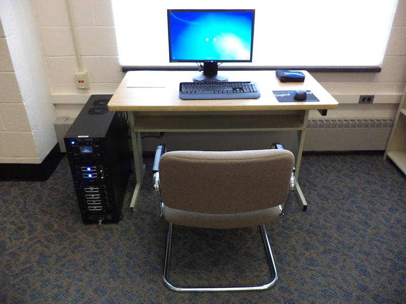

_This post was written by Eric Cartier and also appears on the [Special Collections blog](http://hornbakelibrary.wordpress.com/2013/04/05/born-digital-working-group-configuring-fred/ "University of Maryland Special Collections Blog")._ 

In mid-March, the Tools subgroup met FRED, our Forensic Recovery of Evidence Device. The subject lines we’ve shared since then (e.g., “tinkering with FRED today”) reflect the approach we’re taking: careful, playful, open-minded. We marveled at all the ports, laid out and photographed the various cables and adapters included in the toolbox, and took turns at the keyboard. There was much to do before any imaging occurred, though.

We spoke at length about network security, viruses, connecting to the Internet, and safeguarding personally identifiable information, which we’re sure to obtain in future images we make. Porter noted that Digital Intelligence, the company that manufactures FRED, assumes that one will connect the machine to the Internet, while Josh played the devil’s advocate, acting Thomas Pynchon-paranoid. The immediate action we took at the conversation’s conclusion was to connect to the Internet via a USB network adapter to install Microsoft Security Essentials. Next we updated all the Windows, Adobe, and Java applications. A clean machine, we agreed, should be virus protected and fitted with all the latest software updates.

The FRED system has two drives, one of which is dual partitioned into Windows 7 Ultimate (64 bit) and Win98 DOS. This is the operating system environment we initially worked in, where we made other essential downloads including BitCurator and Oracle VM VirtualBox. Later, because BitCurator is native Linux, we chose to install SUSE Linux 12.1 on FRED’s empty DATA drive.

Returning to Windows 7, the first device we connected to the UltraBay 3D Hardware Write-Blocker was Digital Stewardship’s 2 TB external hard drive, which contained images of some media from the Bill Bly Collection. Tableau Imager didn’t recognize it, nor did it register a 2 GB thumb drive that we inserted in the USB 3.0 port, although each device was visible on the list of the computer’s drives. Reading through the text-based instructions again, we discovered that the UltraBay has a power supply independent of the FRED tower (Digital Intelligence does not include diagrams or screenshots in its instructions), which, once turned on, allowed us to image the thumb drive. No matter which target directory we selected, however, the external hard drive repeatedly failed to image, due to lack of storage space. Tableau Imager offers EnCase E01 and Raw Disk dd imaging options, both of which are set to capture all the bits, so 2 TB was a bit much to ask of the machine.

Our progress configuring FRED has been fun and sometimes frustrating, but always steady. Over the next couple of months, our goal is to attempt to image every imaginable format on FRED and our BitCurator Digitization Workstation. Which system, with which software (BitCurator, Tableau Imager, FTK Imager), works most effectively? Learning what’s possible to accomplish with our equipment will be a beneficial exercise to complete before the arrival of our National Digital Stewardship Residency fellow in September.