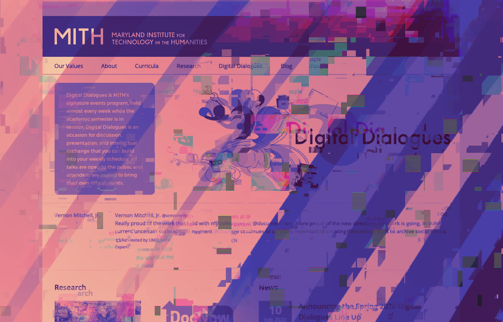

The occasion for this post is plainly visible. As you can see, we're changing MITH's website. The previous design served us for most of a decade—an eternity in Internet time. The basic organization of the MITH site stayed the same from 2011 until this year. As far back as the summer of 2012, the visual style of the now-former site is recognizable. (You can browse the full history of the MITH website at the [Internet Archive](https://web.archive.org/web/*/mith.umd.edu).) But this post is not a "launch" post.

At this point the new MITH website isn't a fancy, full-on replacement for the old one. It is minimal, even modest. The new site might even give the impression—on the date this post is published—that a lot of "content" that used to be here is missing. (It's not—more on this in a moment.) The reason for exposing this state of affairs isn't because we ran out of time or ideas for the new website. Instead, the reason is tied to a philosophical commitment so, to explain, I'll say a little more about our non-launch.

Given the timing of MITH's founding and growth, it quickly became apparent that the web (rather than say, physical media like floppy disks or CD-ROMs) would be the avenue for much digital work here as elsewhere. In MITH's case, I would push the claim a little further. Over the years, researchers at MITH have produced a sizable body of work concerned with the preservation and curation of digital media. As a group, the researchers who have been and still are based here are committed to the web in particular as [a medium for scholarship](http://smallaxe.net/sxarchipelagos/issue03/parham/parham.html) and also to [thinking about how to preserve it](https://inkdroid.org/2020/10/28/seeing-software/). I mark this as an active choice and a distinctive element of MITH's research character. In terms of our website, this translated into two impulses that result in what you see now.

First, we could start this new version of the site small because the old site wasn't going away. In a [paradigm of maintenance](https://themaintainers.org/), we can be honest that a "launch" is just telling one kind of story about the digital materials we have. Our commitment to preserving the web means that the archive is as meaningful a part of our site as any other. In changing the MITH website we followed the same process we described in our [2015–2016 series](https://archive.mith.umd.edu/mith-2020/tag/mith-digital-stewardship-series/) on stewarding MITH's legacy of web-based research projects. The previous version of this site is included in MITH's online (and offline) [archive](https://archive.mith.umd.edu/mith-2020/). As we rethink and redevelop additional pages, like those focused on the digital dialogue talk series, they will appear in the main MITH domain namespace.

Second, for those who are interested in this sort of information, the new version of the MITH website is a static website, replacing one built on the Wordpress content management software. This change puts us into a relationship with our materials that supports our continued thinking about the web as a medium for scholarship. There is no single right way to build a website—this is just the right way for us right now. When the basic arrangement of the previous site was selected, MITH was building a number of digital projects on the basic chassis of the Wordpress software. This hasn't been the way that we build projects in more recent years. There are always benefits and drawbacks but now the main MITH website is using the same kinds of tools and workflows that we are using on projects like the soon-to-be-more-widely-released [Unlocking the Airwaves](https://archive.mith.umd.edu/mith-2020/research/unlocking-the-airwaves/). I am happy to be working on it alongside my colleagues—with many members of the team taking a piece and lending a hand or an idea. In addition to building the MITH site in public, you will also see us trying a number of new genres, modes, and rhythms for sharing our work through the site.

I referred to this statically-built, currently minimal version of the site putting us into a certain kind of relationship with our materials. I did not mean principally HTML, CSS, and Javascript. I referred to this as a "non-launch." Rather than taking a change in website design as an occasion to celebrate new-ness and shininess (the data of the website is continuing on after all) I am interested in this as a (small) opportunity to enter a new kind of relation—that of vulnerability. Things look different around here. We're clearing some space to make new work. 